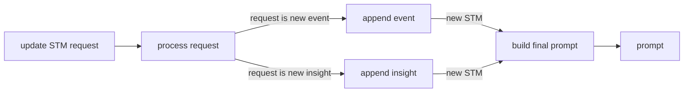
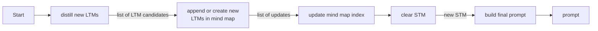
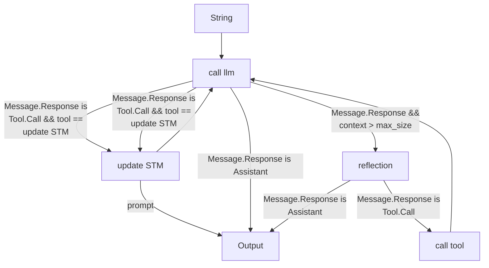
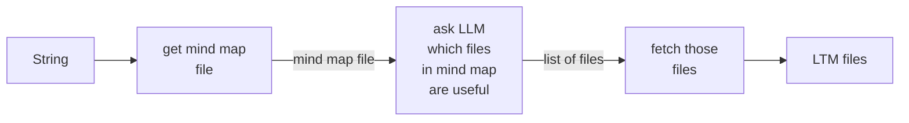
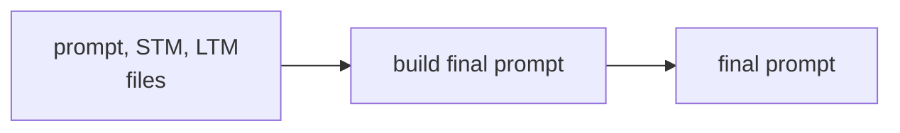
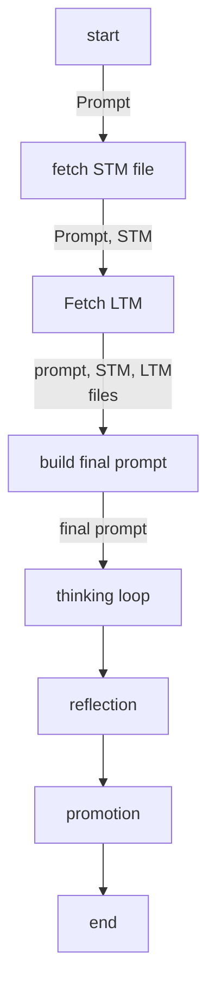

# Graph Specifications

This document contains the workflow diagrams for the Brainiac AI memory system.

## 1. Update STM

## 2. Promotion

## 3. Thinking Loop

## 4. Fetch LTM

## 5. Build Final Prompt

## 6. Setup (Overall Flow)

